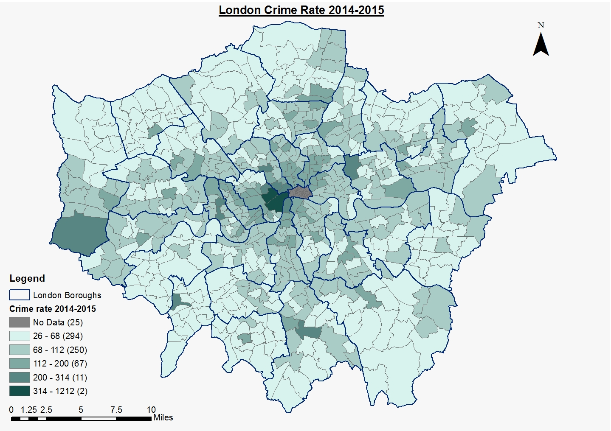

This is an [R Markdown](http://rmarkdown.rstudio.com) Notebook. When you execute code within the notebook, the results appear beneath the code and some more code. 
```{r echo=TRUE}
library(tidyverse)
library(geojsonio)
library(sf)
library(tmap)
library(tmaptools)
#read some data attributes
LondonData <- read_csv("https://files.datapress.com/london/dataset/ward-profiles-and-atlas/2015-09-24T14:21:24/ward-profiles-excel-version.csv", na = "n/a")
#read some geometries
EW <- geojson_read("http://geoportal.statistics.gov.uk/datasets/8edafbe3276d4b56aec60991cbddda50_2.geojson", what = "sp")
#pull out London
LondonMap <- EW[grep("^E09",EW@data$lad15cd),]
#convert to a simple features object
LondonMapSF <- st_as_sf(LondonMap)
#append the data to the geometries
LondonMapSF <- append_data(LondonMapSF,LondonData, key.shp = "lad15cd", key.data = "New code", ignore.duplicates = TRUE)
#plot a choropleth
qtm(LondonMapSF, fill = "% Not Born in UK - 2011")
```
=======
output: html_notebook
---

This is an [R Markdown](http://rmarkdown.rstudio.com) Notebook. When you execute code within the notebook, the results appear beneath the code. 
image: 
Try executing this chunk by clicking the *Run* button within the chunk or by placing your cursor inside it and pressing *Cmd+Shift+Enter*. 
image: 
[@ben_ben_hello_nodate; @hannah_gumble_test2_nodate]

```{r}
plot(cars)
```
